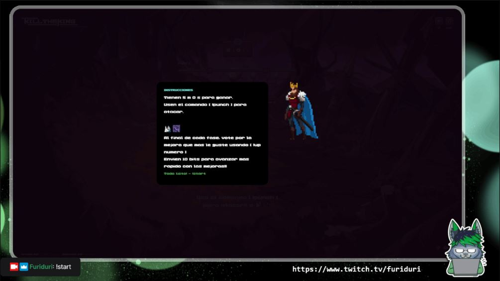
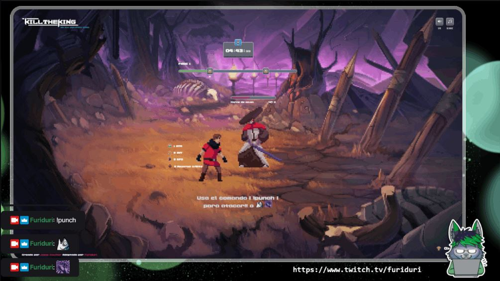
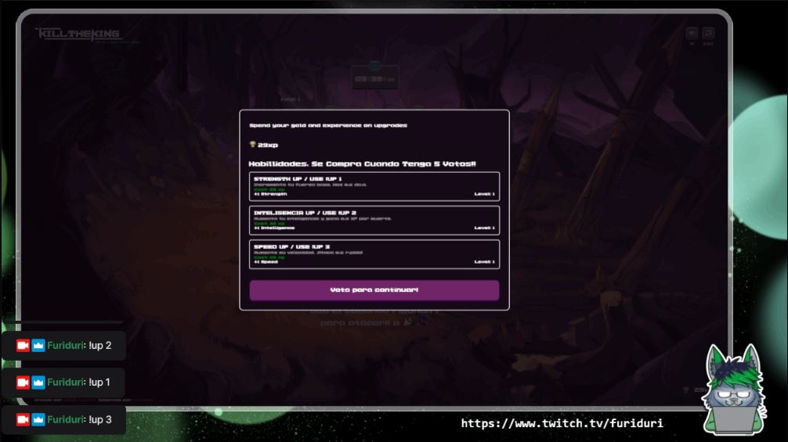
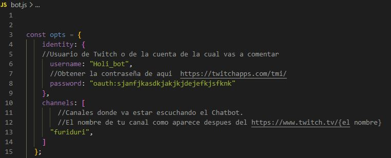
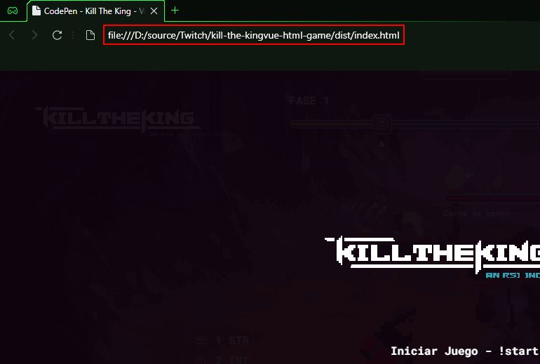

# Introducción
Juego destinado para el Tren del Hype en un stream de Twitch.

El juego **Kill The King** va de derrotar los malvados Samurais, he ir mejorando hasta llegar al jefe final, pero cuidado que los Viewers tienen un limite de tiempo antes de que su personaje sucumba al mal.

# Fases del juego
## Inicio

Se debe usar `!start` para ver las instruciones, otro `!start` para iniciar el combate.

## Durante el combate

Se debe usar los comandos `!punch` o `!a`, para atacar, tambien pueden atacar con los emojis [`BlacklivesMatter` , `SabaPing`]

## Fase de compras

Al termino de cada nivel, se permite mejorar al personaje comprando con sus puntos de **XP** conseguidos durante el combate.

Para comprar la mejora se debe usar el comando `!up [1,2,3]` (numero de la mejora), para votar por cual mejora comprar, al cumplir los [ `config.minvotes` ], se comprara la mejora, asi hasta que ya no se pueda comprar mas, y continuar con el combate.

      Los viewers pueden votar cuantas veses quieran!

# Comandos
##  Comando para el Mod
`!start` - Mostrar instruciones e iniciar el juego.

`!restart` - Reiniciar el juego.

## Chat
`!punch` - Golpear.

**Emojis** [`BlacklivesMatter` , `SabaPing`] - Golpear.

`!a` - Golpear.

`!up [1,2,3]` - Votar por una mejora de las 3 mejoras.

# Envios de bits (cheers)
 Al juntar una suma de [ `config.minbits` ], se consige una mejora al personaje de manera aleatoria.

# Como usarlo

## 1. Descargar 
Puedes descargar el `.Zip` o usar Git para clonar el repositorio
      
      `$ git clone https://github.com/Furiduri/Kill-The-King-Twitch-bot.git`

## 2. Configura el Bot

Entra al archivo `bot.js` y sigue sus instruciones.

## 3. A disfrutar

Puedes abrir el archivo `index.html` en cualquier navegador, o abrirlo en el OBS o otro programa se Streaming, como un elemento de origen del navegador usando la URL que aparece en su navegador.

## Eso es todo?

      Yep, eso es todo, una ves vista la pantalla de inicio del juego, ya podras usar los comandos en el chat, para poder interactuar con el juego.

      Claro, tambien puedes interactuar con el teclado y raton si lo quieres probar sin comandos,
      usando la tecla espacio para atacar.

# Creditos

El juego usado como base fue creado por **Jamie Coulter** puedes encontrar el juego sin modificaciones en [CodePen.io](https://codepen.io/jcoulterdesign/pen/MWeZWxQ).

La idea de adaptarlo para juegar con el chat de Twitch, fue de [Hey_Samwell](https://www.twitch.tv/hey_samwell).

y claro quien se puso las pilas para adaptarlo yo [Furiduri!](https://www.twitch.tv/furiduri) , pueden buscarme en [Twitch](https://www.twitch.tv/furiduri) estare trabajando en mas cosillas de este estilo en directo.

 

